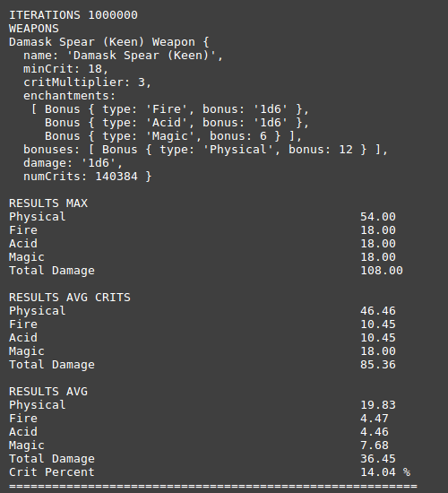
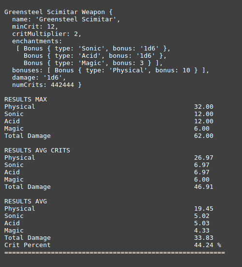

# 3e-damage-tester
A simple average damage calculator for D&amp;D 3e

# Usage

```js
const {Stats, Weapon} = require('3e-damage-tester')
const ITERATIONS = 1000000

let w1 = new Weapon({
  name: 'Damask Spear (Keen)',
  critRange: 18,
  critMultiplier: 3,
  enchant: [
    {
      type: 'Fire',
      bonus: '1d6'
    },
    {
      type: 'Acid',
      bonus: '1d6'
    },
    {
      type: 'Magic',
      bonus: 6
    }
  ],
  bonus: [
    {
      type: 'Physical',
      bonus: 12
    }
  ],
  damage: '1d6'
})

let w2 = new Weapon({
  name: 'Greensteel Scimitar',
  critRange: 12,
  critMultiplier: 2,
  enchant: [
    {
      type: 'Sonic',
      bonus: '1d6'
    },
    {
      type: 'Acid',
      bonus: '1d6'
    },
    {
      type: 'Magic',
      bonus: 3
    }
  ],
  bonus: [
    {
      type: 'Physical',
      bonus: 10
    }
  ],
  damage: '1d6'
}

let stats = new Stats([w1, w2])
stats.run(ITERATIONS).report()
```

# Results


